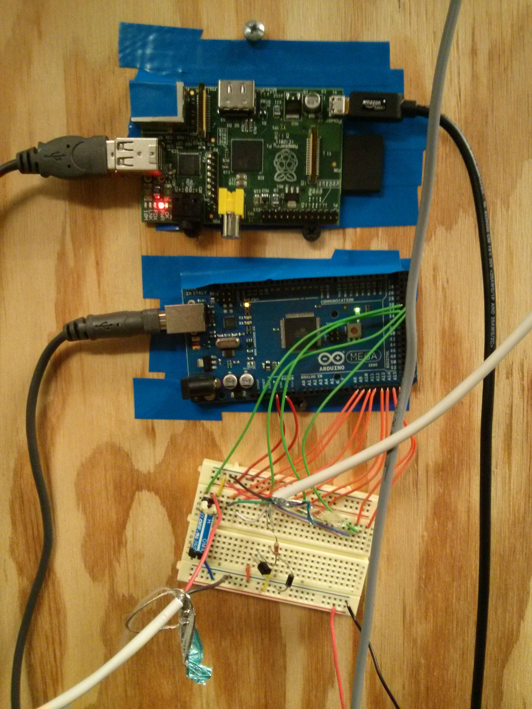

arduino-pro-rfid
================

Arduino pro RFID card reader and twisted/python raspberry pi setup

Hardware setup
----------------
- Wire up to 4 Weigand protocol RFID readers to pins A8-A15.  Where reader0 is A8-A9, reader1 is A10-11, etc...
- Wire up to 4 door latches to pins 30-33.  Where door0 is pin30, door1 is pin31, etc.. This pin will go HIGH, enabling the door to unlock.
- Compile the firmware by running `make`
- Flash the firmware by running `make flash`

Protocol Definition
--------------------
When the arduino receives a card read, it will output the following:
  <DOOR_ID>:<BINARY_CARD_DATA>
  
In the binary data, bits 1-8 are the card's facility code, and bits 10-24 are the card's ID

To open or close a door, you can send a command over the serial port:
  <DOOR_ID>:<0 to close door|1 to open door>\n
  
For example
- To open door0, send: `0:1\n`
- To close door2, `2:0\n`

Software setup
--------------
In the software directory, you can run `twistd -noy service.py` to start the door monitoring service.
You can have several txt files in the `tmp` directory named door_x.txt, where each line of the file is the card ID.
The service is setup so that it reads the file on each card read, and if the id is present in the file, it will
send the door open command followed 5 seconds later by the door close command.
